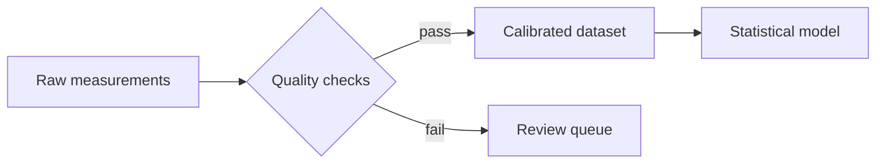

# Code, Algorithms, and Diagrams

Technical papers often mix executable code, pseudocode, configuration, terminal transcripts, and architecture diagrams. Label each artifact precisely so readers know whether it is meant to run.

## Fenced code blocks

Use triple backticks and a language identifier:

````markdown
```python
def mean(values: list[float]) -> float:
    return sum(values) / len(values)
```
````

The identifier controls syntax highlighting; it does not execute the block. Typora supports many language names and lets you change the language from the code block’s control.

For shell sessions, distinguish commands from output:

````markdown
```console
$ uv run analysis.py --input data/run-17.csv
Loaded 10,000 observations
Wrote results/summary.json
```
````

Do not include a shell prompt in blocks intended for direct copy and paste. Record software versions, random seeds, input identifiers, and expected outputs near reproducibility-critical code.

## Long code and printed output

Typora can show line numbers and either wrap long lines or provide horizontal scrolling while editing. PDF and printed code wraps because paper has no scrollbar. Keep important examples narrow enough to survive the intended page size.

For more than roughly one screen of code, prefer a linked source file or repository and quote only the portion required to understand the paper. Line numbers are presentation metadata, not part of the copied code.

## Pseudocode

Markdown has no standard algorithm block. A labeled plain-text fence is portable and honest:

````markdown
```text
Algorithm: Robust trimmed mean
Input: observations x, trim fraction q
1. Sort x.
2. Remove q observations from each tail.
3. Return the mean of the remaining values.
```
````

Use a table only when the algorithm is genuinely tabular. Avoid pretending pseudocode is a supported programming language merely to obtain highlighting.

## Mermaid diagrams

**Typora / export-sensitive.** Enable diagrams under **Preferences → Markdown**, then use a `mermaid` fence:

````markdown

````

Typora supports many Mermaid diagram families, including flowcharts, sequences, Gantt charts, class/state diagrams, timelines, mind maps, and XY charts. Use diagrams to reveal relationships that are harder to see in prose, not to replace a straightforward list.

Diagram fences are not standard Markdown, CommonMark, or GFM. Typora includes rendered diagrams in HTML, PDF, EPUB, and Word exports, but other Markdown conversion paths may not understand them. The repository documentation recommends inserting a static image when portability matters most.

## A robust diagram workflow

1. Keep the Mermaid source in the manuscript or a neighboring `.mmd` file.
2. Save a reviewed SVG or PNG rendering in `assets/`.
3. Decide which is canonical for the target workflow: the live fence or the static image.
4. Do not include both in the final paper unless one is hidden by a controlled publishing step.
5. Check the diagram with the actual export theme; some Mermaid CSS options come from the currently active theme rather than a different theme selected only for export.

Typora can save a rendered diagram as SVG, PNG, or JPEG from its context menu.

## Other diagram fences

Typora also documents `sequence` fences backed by js-sequence-diagrams and `flow` fences backed by flowchart.js. Mermaid covers more diagram types and is generally the better single convention for a new project, but it is still a Typora extension rather than portable Markdown.

## Diagram accessibility

- Give every diagram a descriptive caption in the final paper.
- Explain the important path or relationship in prose.
- Avoid relying on color alone.
- Keep labels large enough for the final page size.
- Prefer left-to-right flow for wide screens and top-to-bottom flow for narrow pages.
- Avoid diagrams that become illegible when reduced to a single journal column.

Further reading: [Code Fences](https://support.typora.io/Code-Fences/), [supported fence languages](https://support.typora.io/Code-Fences-Language-Support/), and [Draw Diagrams With Markdown](https://support.typora.io/Draw-Diagrams-With-Markdown/).
