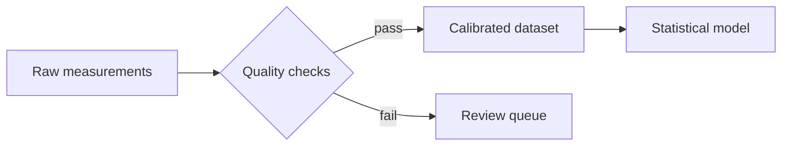

# Typora Markdown for Scholarly and Technical Writing

Typora is especially useful for technical prose because it combines a readable plain-text source format with live rendering of equations, tables, code, diagrams, links, and figures. This guide shows how to use that authoring environment without confusing three different things:

- **Portable Markdown** that works in Typora and most other Markdown tools.
- **Typora extensions** such as `[toc]`, MathJax equation references, and diagram fences.
- **Output-specific features** whose behavior depends on whether you export to PDF, HTML, Word, LaTeX, or another format.

The safest workflow is to keep the body of a paper mostly portable, use Typora extensions deliberately, and test the final export format early.

## Recommended Typora setup

Open **Preferences → Markdown** and review these settings before beginning a technical document:

1. Enable **Inline Math**.
2. Choose an equation-numbering mode if the paper refers to equations.
3. Enable **Diagrams** only if the project will use diagram fences.
4. Choose code-fence line-number and wrapping behavior. Printed and PDF code blocks wrap even when the editor uses horizontal scrolling.
5. Configure image insertion so pasted and dropped images go into a project-owned asset directory.

When a Markdown setting cannot be applied immediately, current Typora versions offer to reload the editor window. Follow that prompt before judging the document’s rendering.

## Compatibility labels used in this guide

| Label | Meaning |
| :-- | :-- |
| **Portable** | Generally safe in GFM-style Markdown tools as well as Typora. |
| **Typora** | Rendered by Typora but not guaranteed in other Markdown engines. |
| **Export-sensitive** | Must be checked in every required output format. |

## Contents

1. [A portable scholarly Markdown foundation](#a-portable-scholarly-markdown-foundation)
2. [Document structure, metadata, and navigation](#document-structure-metadata-and-navigation)
3. [Mathematics, chemistry, and equations](#mathematics-chemistry-and-equations)
4. [Tables, figures, and quantitative results](#tables-figures-and-quantitative-results)
5. [Code, algorithms, and diagrams](#code-algorithms-and-diagrams)
6. [Citations, notes, and cross-references](#citations-notes-and-cross-references)
7. [Files, assets, collaboration, and portability](#files-assets-collaboration-and-portability)
8. [Exporting and publication handoff](#exporting-and-publication-handoff)
9. [Reusable article blueprint and checklist](#reusable-article-blueprint-and-checklist)

## How to use the two editions

The `multifile/` directory is the maintainable source edition. Its `index.md` links to one file per chapter. Run the repository’s `multifile_to_singlefile_md.py` script to regenerate `singlefile/typora-stem-guide.md`, which is convenient for reading, searching, and exporting as one document.

## Documentation basis

This guide synthesizes the Typora behavior documented in this repository, especially the pages on [Markdown syntax](https://support.typora.io/Markdown-Reference/), [math and academic functions](https://support.typora.io/Math/), [images](https://support.typora.io/Images/), [tables](https://support.typora.io/Table-Editing/), [code fences](https://support.typora.io/Code-Fences/), [diagrams](https://support.typora.io/Draw-Diagrams-With-Markdown/), [YAML front matter](https://support.typora.io/YAML/), and [export](https://support.typora.io/Export/).

---

# A Portable Scholarly Markdown Foundation

Start with the smallest syntax set that expresses the paper clearly. A portable core is easier to review in Git, process with other tools, and preserve when a collaborator does not use Typora.

## Paragraphs and line breaks

Separate paragraphs with a blank line. Do not wrap lines manually merely to control their displayed width; the theme and export format determine that width.

Typora creates a visible soft line break with **Shift+Return**, but many Markdown parsers ignore an ordinary single newline. When a line break is semantically necessary, use two trailing spaces or `<br>` and mark it as export-sensitive. Most technical prose should use separate paragraphs instead.

## Headings are the document skeleton

Use one level-1 heading for the article title, level 2 for major sections, and deeper levels only when needed:

```markdown
# Article title

## Abstract

## 1. Introduction

### 1.1 Motivation

## 2. Methods
```

Do not choose heading levels for visual size. Typora derives its outline, `[toc]`, internal links, and exported PDF bookmarks from heading structure. Skipping from `##` to `####` makes all of those structures harder to understand.

Manual numbers are useful when a venue expects numbered sections, but they become part of the heading text and therefore part of its generated link target. Add them only after deciding who owns numbering: the Markdown source, a stylesheet, or a later publishing system.

## Emphasis and technical identifiers

Use emphasis for meaning rather than decoration:

```markdown
The *a priori* hypothesis predicts a **monotonic** response.
The `sample_id` column is the primary key.
```

- Use `*italics*` for introduced terms, variables in prose when math is unnecessary, and conventional phrases.
- Use `**bold**` sparingly for warnings or conclusions.
- Use backticks for filenames, commands, configuration keys, function names, and literal values.
- Prefer a fenced code block over inline code when a fragment spans multiple lines.

Backticks protect underscores in identifiers such as `raw_sample_count` from being mistaken for emphasis.

## Lists and procedures

Use unordered lists for sets and ordered lists for sequences. A laboratory or computational procedure should state prerequisites and observable outcomes, not merely actions.

```markdown
1. Calibrate the sensor against the 0.5 V reference.
2. Record 100 samples at 1 kHz.
3. Reject the run if drift exceeds 2%.
```

Task lists are a GFM extension supported by Typora. They are excellent for an internal reproducibility checklist but usually inappropriate in a submitted manuscript:

```markdown
- [x] Freeze the analysis environment.
- [ ] Archive the raw data.
- [ ] Record the artifact DOI.
```

## Quotations and callouts

Use blockquotes for quoted or set-apart material:

```markdown
> The calibration applies only within the stated temperature range.
```

GitHub-style alerts are a preference-controlled Typora feature and are not portable. For durable technical warnings, a labeled blockquote is clearer:

```markdown
> **Caution.** Disconnect the supply before changing the probe range.
```

## Escaping literal Markdown

Escape punctuation with a backslash when it would otherwise be parsed:

```markdown
The wildcard is written as \* and the literal variable is price\_usd.
```

For long literal samples of Markdown, surround an inner triple-backtick fence with a four-backtick or tilde fence. This prevents the example from ending its own container.

## A conservative portability profile

For a manuscript that must survive multiple processors:

- Prefer ATX headings (`## Methods`) over decorative heading forms.
- Use explicit `https://` schemes in links.
- Use relative paths for project-owned figures.
- Use GFM tables only for simple tabular data.
- Keep raw HTML, Typora diagrams, `[toc]`, highlights, subscripts, and superscripts optional.
- Put mathematical notation in MathJax/TeX rather than Unicode approximations when the notation is nontrivial.

Typora broadly follows GFM, but no Markdown dialect is universal. Portability is a tested property, not a promise implied by the `.md` extension.

Further reading: [Typora Markdown Reference](https://support.typora.io/Markdown-Reference/) and [Strict Mode](https://support.typora.io/Strict-Mode/).

---

# Document Structure, Metadata, and Navigation

A scholarly document needs two structures at once: the visible argument and machine-readable information about the document. Markdown headings provide the first; YAML front matter can provide the second.

## YAML front matter

**Typora / export-sensitive.** YAML front matter must be the first content in the file, enclosed by `---` lines, and valid YAML.

```yaml
---
title: "Thermal Drift in Low-Cost Optical Sensors"
author:
  - A. Researcher
  - B. Engineer
description: A controlled study of sensor drift from 5 to 45 degrees Celsius.
keywords: [optical sensors, calibration, thermal drift]
date: 2026-07-10
---
```

Quote values that contain punctuation YAML could interpret. Indent with spaces, never tabs. Keep the block small unless a downstream tool has a documented need for additional fields.

Typora can use fields such as `title`, `author`, `subject`, `creator`, and `keywords` as PDF metadata. Pandoc-based exports may also interpret their own metadata and template variables. Per-document export settings from YAML require an explicit opt-in under Typora’s export preferences because imported documents should not silently override export configuration.

## A practical paper structure

The exact headings vary by discipline, but the following order works for many empirical and engineering articles:

```markdown
# Title

## Abstract

## Keywords

## 1. Introduction

## 2. Related work

## 3. Materials and methods

## 4. Results

## 5. Discussion

## 6. Limitations

## 7. Conclusion

## Data and code availability

## Acknowledgments

## References

## Appendices
```

Treat the abstract as a miniature argument: context, question, method, primary result, and implication. Do not rely on formatting that will disappear when the abstract is copied into a submission form.

## Table of contents and outline

**Typora.** Put `[toc]` on its own line to insert an automatically updated table of contents:

```markdown
[toc]
```

Other Markdown engines may show those five characters literally. Typora exports its TOC through its built-in export paths, but a third-party processor may use a different directive. The Outline panel provides heading navigation without putting `[toc]` in the document.

For a journal article, the outline is usually useful while drafting and the visible TOC is usually omitted. For a thesis, report, protocol, or long technical manual, a visible TOC is often appropriate.

## Internal links

Link to a heading by using its generated fragment:

```markdown
The assumptions are summarized in [Limitations](#6-limitations).
```

Generated fragments depend on heading text. Renaming a heading can break links, and duplicate headings receive numbered suffixes. For long-lived targets, use a named HTML anchor:

```html
<a id="sec-calibration"></a>

## 3.2 Calibration procedure
```

Then link to it with `[calibration procedure](#sec-calibration)`. Raw HTML is less portable to non-HTML outputs, so test named anchors in every required export format.

## Links between chapter files

Relative links keep a project movable:

```markdown
See the [measurement protocol](methods.md#measurement-protocol).
```

Typora can open Markdown files and jump to a heading in another file. Include the `.md` extension for clarity and compatibility, even though Typora can sometimes resolve a path without it.

## Reference-style links

Reference-style links keep long URLs out of dense prose:

```markdown
The archive follows the [FAIR principles][fair].

[fair]: https://www.go-fair.org/fair-principles/ "FAIR Principles"
```

Always include the URL scheme. Bare domains and Typora’s automatic URL detection are less portable than explicit links.

Further reading: [YAML Front Matter](https://support.typora.io/YAML/), [Table of Contents](https://support.typora.io/TOC/), [Outline](https://support.typora.io/Outline/), and [Links](https://support.typora.io/Links/).

---

# Mathematics, Chemistry, and Equations

Typora renders TeX/LaTeX-style mathematics with MathJax. Typora 1.13 upgraded to MathJax 4. This is not a full LaTeX runtime: MathJax supports a defined subset of TeX commands, and export formats differ in what they retain.

## Inline mathematics

**Typora.** Enable inline math under **Preferences → Markdown → Math**, restart Typora if requested, and place the expression directly between dollar delimiters:

```markdown
For a first-order process, $y(t)=y_0 e^{-t/\tau}$ and $\tau=RC$.
```

Typora’s current default parsing follows rules close to Pandoc: no whitespace immediately inside either delimiter, the final character cannot be a backslash, and a closing `$` cannot be followed immediately by a digit. These rules prevent ordinary currency from becoming math.

Good:

```markdown
The fitted value is $\alpha=0.05$ and the instrument costs $250.
```

Avoid spaces next to delimiters:

```markdown
Do not write $ \alpha = 0.05 $ in the default parsing mode.
```

Typora offers a legacy compatibility mode for older documents, but new work should use the default rules.

## Display mathematics

Put display math between `$$` lines:

```markdown
$$
\hat{\beta}=(X^\mathsf{T}X)^{-1}X^\mathsf{T}y
$$
```

Use an environment for aligned derivations:

```markdown
$$
\begin{aligned}
E &= mc^2, \\
p &= \gamma mv, \\
\gamma &= \frac{1}{\sqrt{1-v^2/c^2}}.
\end{aligned}
$$
```

MathJax 4 in Typora 1.13 and later supports `\\` line breaks by default. An explicit environment such as `aligned` or `align` still communicates the intended layout more clearly and is safer when a document must also work in older Typora releases or other math renderers.

## Equation numbering and references

Typora can apply no automatic numbering, AMS-style numbering, or numbering to every display equation. For a stable manually numbered equation, use `\tag` and `\label`, then reference it with `\ref` inside inline math:

```markdown
$$
R_0 = \frac{\beta}{\gamma}\label{eq-r0}\tag{1}
$$

An outbreak grows initially when $R_0>1$; see Equation $\ref{eq-r0}$.
```

Keep labels semantic (`eq-r0`, `eq-energy-balance`) rather than positional (`eq3`). That makes source changes less disruptive.

**Export-sensitive.** Equation labels and references are supported in Typora’s math rendering, but not every output preserves them. In particular, this repository’s export documentation notes that `\label` and `\ref` are not supported in the normal Word export path. Test cross-references before choosing an output format.

## Custom commands

MathJax accepts `\def` and `\newcommand` for reusable notation:

```markdown
$$
\newcommand{\vect}[1]{\mathbf{#1}}
\vect{F}=m\vect{a}
$$
```

Custom commands can reduce errors in a notation-heavy document, but they also make isolated excerpts harder to render. Define them near the beginning of a single-file paper and document them for collaborators.

## Chemistry and physics

Typora includes MathJax’s `mhchem` extension:

```markdown
The combustion reaction is $\ce{CH4 + 2O2 -> CO2 + 2H2O}$.
```

The optional Physics package must be enabled in **Preferences → Markdown → Math** before using its commands. Because package availability varies outside Typora, prefer basic TeX notation when the manuscript will pass through several renderers.

## Units, uncertainty, and notation

Use consistent prose around equations:

- Define every symbol at first use.
- Put units beside reported values: `$12.4 \pm 0.3$ mV`.
- Distinguish a variable from its unit and a scalar from a vector consistently.
- Do not encode meaning through color alone.
- Give an equation a display block only when it deserves visual or referential prominence.

## Troubleshooting and limitations

If equations appear stale or numbering becomes inconsistent, use **Edit → Math Tools** to force a refresh. If a command fails, check MathJax’s supported TeX command set rather than assuming every LaTeX package is present.

Before submission, verify:

1. Every display equation renders without an error indicator.
2. Every reference points to the intended equation.
3. Line breaks, matrices, chemical expressions, and custom commands survive export.
4. Fonts and symbols are legible at the final page size.

Further reading: [Math and Academic Functions](https://support.typora.io/Math/), [Typora’s MathJax support](https://support.typora.io/Support-MathJax/), and the [Typora 1.13 release notes](https://support.typora.io/What's-New-1.13/).

---

# Tables, Figures, and Quantitative Results

Tables and figures should communicate a result, not merely decorate the document. Design each one to remain understandable when read separately from the surrounding paragraph.

## GFM tables

**Portable within GFM-style tools.** A table needs a header and delimiter row:

```markdown
| Method | Accuracy (%) | Runtime (s) |
| :-- | --: | --: |
| Baseline | 82.1 | 14.8 |
| Proposed | **89.7** | 11.3 |
```

Colons in the delimiter row control alignment. Left-align text and right-align measured numbers. Typora’s table toolbar can add, remove, resize, align, and reorder rows or columns while maintaining the Markdown source.

Use tables for values readers may need to compare or reuse. Use a chart when pattern, trend, or distribution is the point. Do not present the same data in both forms unless each view answers a different question.

## Table constraints

Markdown tables are intentionally simple. They do not provide reliable merged cells, multirow headers, footers, or rich cell layout across processors. For complex results:

- split a wide table into focused tables;
- move secondary columns to an appendix;
- abbreviate carefully and define abbreviations below the table;
- round values consistently and state the precision rule;
- avoid hard-coded spaces for alignment;
- test wide tables in PDF, where they may shrink or overflow.

Inline emphasis, links, and code generally work in cells. Multiline blocks and display equations generally do not. Use compact inline math such as `$p<0.01$` and keep derivations outside the table.

## Images and figure files

Markdown stores a reference to an image, not the image itself:

```markdown

```

The bracketed text is alternative text. Describe the information a reader should obtain from the figure, not merely “chart” or “image.” Use project-relative paths and stable filenames.

A practical asset layout is:

```text
paper/
├── paper.md
└── assets/
    ├── fig-calibration-residuals.png
    ├── fig-system-architecture.svg
    └── table-supplement.csv
```

Under **Preferences → Image**, enable copying images to a chosen folder and using relative paths. Typora can store per-document behavior in YAML:

```yaml
---
typora-copy-images-to: ./assets
---
```

The `typora-root-url` YAML field changes how root-relative image paths are previewed in Typora; it is useful for static sites but less useful for a self-contained paper directory.

## Captions

Plain Markdown has no standard figure-caption syntax. The most portable lightweight pattern is an image followed by an italicized paragraph:

```markdown


*Figure 2. Residuals remain centered across the fitted range; shading shows the 95% interval.*
```

Number captions only when the source document owns numbering. If a publisher or later tool assigns figure numbers, use an unnumbered descriptive caption during drafting.

HTML can express a semantic figure and caption:

```html
<figure id="fig-residuals">
  
  <figcaption>Figure 2. Residuals remain centered across the fitted range.</figcaption>
</figure>
```

**Export-sensitive.** HTML figures work best in HTML and browser-based PDF output. Raw HTML may become plain text or disappear in Word and LaTeX exports.

## Cross-referencing tables and figures

Typora does not provide a general automatic figure/table reference system. Use a stable named anchor when manual links are valuable:

```html
<a id="table-ablation"></a>

| Variant | F1 score |
| :-- | --: |
| Full model | 0.91 |

*Table 3. Ablation results.*
```

Then write `See [Table 3](#table-ablation).` This preserves navigation but does not update the visible number automatically. Search for `Figure ` and `Table ` after renumbering.

## Figure quality checklist

- Prefer SVG or PDF-like vector content for diagrams when the output path supports it; use PNG for raster plots and screenshots.
- Export plots at their final aspect ratio with readable labels.
- Use colorblind-safe palettes and redundant encodings such as shape or line style.
- Include units on axes and define uncertainty bands.
- Keep the data and script that generated each plot beside the manuscript or in a linked archive.
- Open the exported paper at 100% scale and inspect every figure.

Further reading: [Table Editing](https://support.typora.io/Table-Editing/), [Images in Typora](https://support.typora.io/Images/), and [Resize Image](https://support.typora.io/Resize-Image/).

---

# Code, Algorithms, and Diagrams

Technical papers often mix executable code, pseudocode, configuration, terminal transcripts, and architecture diagrams. Label each artifact precisely so readers know whether it is meant to run.

## Fenced code blocks

Use triple backticks and a language identifier:

````markdown
```python
def mean(values: list[float]) -> float:
    return sum(values) / len(values)
```
````

The identifier controls syntax highlighting; it does not execute the block. Typora supports many language names and lets you change the language from the code block’s control.

For shell sessions, distinguish commands from output:

````markdown
```console
$ uv run analysis.py --input data/run-17.csv
Loaded 10,000 observations
Wrote results/summary.json
```
````

Do not include a shell prompt in blocks intended for direct copy and paste. Record software versions, random seeds, input identifiers, and expected outputs near reproducibility-critical code.

## Long code and printed output

Typora can show line numbers and either wrap long lines or provide horizontal scrolling while editing. PDF and printed code wraps because paper has no scrollbar. Keep important examples narrow enough to survive the intended page size.

For more than roughly one screen of code, prefer a linked source file or repository and quote only the portion required to understand the paper. Line numbers are presentation metadata, not part of the copied code.

## Pseudocode

Markdown has no standard algorithm block. A labeled plain-text fence is portable and honest:

````markdown
```text
Algorithm: Robust trimmed mean
Input: observations x, trim fraction q
1. Sort x.
2. Remove q observations from each tail.
3. Return the mean of the remaining values.
```
````

Use a table only when the algorithm is genuinely tabular. Avoid pretending pseudocode is a supported programming language merely to obtain highlighting.

## Mermaid diagrams

**Typora / export-sensitive.** Enable diagrams under **Preferences → Markdown**, then use a `mermaid` fence:

````markdown

````

Typora supports many Mermaid diagram families, including flowcharts, sequences, Gantt charts, class/state diagrams, timelines, mind maps, and XY charts. Use diagrams to reveal relationships that are harder to see in prose, not to replace a straightforward list.

Diagram fences are not standard Markdown, CommonMark, or GFM. Typora includes rendered diagrams in HTML, PDF, EPUB, and Word exports, but other Markdown conversion paths may not understand them. The repository documentation recommends inserting a static image when portability matters most.

## A robust diagram workflow

1. Keep the Mermaid source in the manuscript or a neighboring `.mmd` file.
2. Save a reviewed SVG or PNG rendering in `assets/`.
3. Decide which is canonical for the target workflow: the live fence or the static image.
4. Do not include both in the final paper unless one is hidden by a controlled publishing step.
5. Check the diagram with the actual export theme; some Mermaid CSS options come from the currently active theme rather than a different theme selected only for export.

Typora can save a rendered diagram as SVG, PNG, or JPEG from its context menu.

## Other diagram fences

Typora also documents `sequence` fences backed by js-sequence-diagrams and `flow` fences backed by flowchart.js. Mermaid covers more diagram types and is generally the better single convention for a new project, but it is still a Typora extension rather than portable Markdown.

## Diagram accessibility

- Give every diagram a descriptive caption in the final paper.
- Explain the important path or relationship in prose.
- Avoid relying on color alone.
- Keep labels large enough for the final page size.
- Prefer left-to-right flow for wide screens and top-to-bottom flow for narrow pages.
- Avoid diagrams that become illegible when reduced to a single journal column.

Further reading: [Code Fences](https://support.typora.io/Code-Fences/), [supported fence languages](https://support.typora.io/Code-Fences-Language-Support/), and [Draw Diagrams With Markdown](https://support.typora.io/Draw-Diagrams-With-Markdown/).

---

# Citations, Notes, and Cross-References

This is the area where Markdown tools differ most sharply. Decide at the start whether Typora is the final renderer or only the writing interface for a separate scholarly publishing pipeline.

## Footnotes

Typora supports reference footnotes:

```markdown
The preregistered threshold was retained.[^threshold]

[^threshold]: The threshold was fixed before inspecting the held-out set.
```

Identifiers need only be unique, but meaningful identifiers such as `threshold` or `sensor-drift` are easier to maintain than `1` and `2`. Place definitions near the end of the section or document according to project convention.

Footnotes are for qualifications, provenance details, or short asides. If information is necessary to follow the argument, keep it in the body. Do not use footnotes as a substitute for a bibliography manager.

## Typora is not a Pandoc citation parser

Pandoc-style citation syntax such as `[@smith2024]` may look attractive in a Markdown source file, but this repository’s Pandoc integration documentation explicitly states that Pandoc Markdown extensions such as citations are not supported by Typora’s normal export flow. Typora converts its own parsed document model to Pandoc; it does not simply hand the original Markdown source to Pandoc.

Therefore choose one of these workflows:

### Workflow A: Typora owns rendering

Write citations as ordinary prose or links and maintain a conventional References section:

```markdown
Prior work found a similar response (Smith and Rao, 2024).

## References

Smith, J., and Rao, P. (2024). “Article title.” *Journal Name* 12(3), 44–58.
https://doi.org/10.0000/example
```

This is simple and visually reliable, but numbering and style changes are manual. A reference manager can still generate formatted bibliography text for pasting.

### Workflow B: an external citation processor owns rendering

Write the citation syntax required by that pipeline, keep the bibliography database with the project, and use Typora primarily as a source editor. The live Typora view may show citation tokens literally. Run the external build to evaluate the real output.

Do not use Typora’s normal Pandoc-based export and assume it behaves like `pandoc manuscript.md --citeproc`; those are different parsing paths.

### Workflow C: staged handoff

Draft with visible author–date placeholders, freeze the content, then migrate citations into the publisher’s Word, LaTeX, or XML workflow. This minimizes tooling during drafting but makes late revisions more expensive.

## DOI and source links

Use explicit links with stable identifiers:

```markdown
[Dataset record](https://doi.org/10.0000/example-data)
```

For a numbered reference list, use ordinary ordered-list syntax only if the numbering is source-owned. Otherwise use unnumbered entries and let the target citation tool assign numbers.

Reference-style Markdown links are useful for frequently repeated project resources, but they do not implement bibliographic citations or citation styles.

## Cross-reference capabilities

| Target | Typora-native approach | Main limitation |
| :-- | :-- | :-- |
| Section | Link to heading fragment | Breaks when heading text changes. |
| Stable location | Raw HTML named anchor | Export-sensitive outside HTML/PDF. |
| Equation | MathJax `\label` and `\ref` | Not preserved by every export, notably normal Word export. |
| Figure or table | Named anchor plus visible manual number | Number does not update automatically. |
| Footnote | `[^id]` reference and definition | A note is not a bibliographic citation. |
| Bibliographic item | Manual prose/link or external processor | No Typora-native citation database/style engine. |

## Maintaining manual references

If the project uses manual figure, table, or reference numbers:

1. Give every target a semantic anchor or source identifier.
2. Use a consistent visible form: `Figure 3`, `Table 2`, `Equation (4)`.
3. Search the entire project for each visible prefix after reordering content.
4. Verify links in both Typora and the final export.
5. Record in the project README whether numbering is manual or generated downstream.

Further reading: [Markdown Reference: Footnotes](https://support.typora.io/Markdown-Reference/#footnotes), [Math: Cross Reference](https://support.typora.io/Math/#cross-reference), [Links](https://support.typora.io/Links/), and [Install and Use Pandoc](https://support.typora.io/Install-and-Use-Pandoc/).

---

# Files, Assets, Collaboration, and Portability

Plain text makes a paper inspectable, but reproducibility depends on the whole project: figures, data, code, environment records, and build instructions.

## Single-file and multifile manuscripts

A single Markdown file is easiest to search and export. Multiple chapter files reduce merge conflicts and make long reports easier to navigate. If you split a document:

- maintain an explicit chapter order;
- keep only one project-level YAML metadata block;
- use unique footnote identifiers across all files if they will be merged;
- use globally unique heading text or named anchors;
- make image paths correct relative to the file that contains them;
- generate the single-file edition instead of editing it by hand.

This guide follows that model: `multifile/index.md` and sorted `chapter-*.md` sources generate one file in `singlefile/`.

## Suggested project layout

```text
study-paper/
├── README.md
├── manuscript/
│   ├── paper.md
│   └── assets/
├── analysis/
├── data/
│   ├── README.md
│   └── derived/
├── references/
└── output/
```

Keep immutable raw data outside normal cleanup scripts. Generated exports belong in `output/` unless a venue requires them elsewhere. The README should identify the canonical manuscript source, required software, build/export path, and location of archived data.

## Image path strategy

Prefer a project-owned asset folder and relative links:

```markdown

```

In Typora, enable **Use relative path if possible** and configure image insertion to copy into the asset folder. Avoid absolute paths such as `/Users/name/Desktop/plot.png`; they work only on one machine. Avoid remote image URLs for final papers because content can change or disappear.

When chapters live in a subdirectory, decide whether every chapter has its own asset directory or shares one. Test the same source from the location where it will actually be opened and merged.

## Source mode and rendered mode

Typora’s rendered editor is excellent for prose and visual review. Use Source Code Mode periodically to catch structural problems:

- an unclosed code fence;
- malformed YAML indentation;
- duplicated link or footnote identifiers;
- accidental raw HTML;
- an absolute local path;
- headings at the wrong level;
- invisible trailing spaces being used as line breaks.

Reviewing the Git diff provides a second, highly effective source-level check.

## Version control

Commit source, small project-owned assets, scripts, and environment declarations. Do not treat an exported PDF as the only record of the paper.

Useful practices include:

- one conceptual change per commit;
- stable filenames rather than `final-v7-revised2.md`;
- generated artifacts clearly identified;
- line-oriented data formats where appropriate;
- no secrets, access tokens, private participant data, or machine-specific paths in the repository;
- tags or releases for submitted versions.

Typora saves ordinary text files, so it works naturally with Git. Its live rendering does not replace review of the actual Markdown diff.

## Collaboration contract

Put these decisions in the project README:

1. Canonical source file or chapter order.
2. Markdown features permitted beyond the portable core.
3. Whether citations and numbering are manual or generated.
4. Image and data locations.
5. Required Typora preference settings.
6. Exact command or menu path for the authoritative output.
7. Checks required before a submission build.

Without this contract, two collaborators can see the same prose in Typora while producing materially different exports.

## Reproducibility packet

For computational work, archive enough information to reconstruct the reported result:

- source data or a precise access record;
- transformation and analysis code;
- dependency lockfile or environment specification;
- parameters, random seeds, and hardware-sensitive settings;
- figure-generation scripts;
- checksums or version identifiers for large external artifacts;
- a short command sequence from clean inputs to final tables and figures.

Link to these materials from a **Data and code availability** section, using a persistent archive identifier when available.

Further reading: [File Management](https://support.typora.io/File-Management/), [Images in Typora](https://support.typora.io/Images/), and [Version Control](https://support.typora.io/Version-Control/).

---

# Exporting and Publication Handoff

The authoritative output is the file the reader or publisher receives, not the Typora editing view. Export early enough to discover layout and conversion constraints while the structure is still easy to change.

## Typora’s two export families

Typora directly supports PDF, HTML, HTML without styles, and image export. Other formats such as Word, OpenDocument, RTF, EPUB, and LaTeX use Pandoc and require a supported Pandoc installation.

Typora’s Pandoc integration first converts Typora’s parsed document into Pandoc’s internal representation, then asks Pandoc to write the target. This keeps conversion aligned with what Typora understood, but it also means the export is not equivalent to running Pandoc directly on the original Markdown source.

## Choosing a target

| Target | Good fit | Watch closely |
| :-- | :-- | :-- |
| PDF (built in) | Review copies, reports, camera-ready fixed layout | Page breaks, wide tables, code wrapping, fonts, headers/footers. |
| HTML | Web publication and interactive review | Theme/CSS dependencies, local assets, raw HTML security. |
| Word (`.docx`) | Editorial track-changes workflows | Math references, raw HTML, diagram conversion, style mapping. |
| LaTeX/PDF through Pandoc | LaTeX templates and print pipelines | Installed engine, template variables, unsupported Typora extensions. |
| EPUB | Long-form reflowable reading | Image sizing, metadata, heading hierarchy. |
| Markdown dialect export | Handoff to another Markdown ecosystem | Loss or rewriting of Typora-only features. |

## PDF

The built-in PDF path uses the selected theme and supports page size, margins, background graphics, headers, footers, and other preferences. It can create PDF bookmarks from the document outline.

Typora can insert page breaks between top-level headings. A manual browser-style page break is:

```html
<div style="page-break-after: always;"></div>
```

That is export-sensitive raw HTML. Use it only when fixed pagination is truly required, and check that it does not leak into another target.

PDF metadata can come from YAML front matter:

```yaml
---
title: Thermal Drift in Low-Cost Optical Sensors
author: A. Researcher
subject: Instrument calibration study
keywords: [optical sensor, calibration, thermal drift]
---
```

## Word and other Pandoc formats

Install Pandoc, restart Typora, and configure its path under **Preferences → Export → General** if Typora cannot find it. A Word style-reference document can control output styles more reliably than manual formatting after every export.

Expect semantic conversion, not pixel-perfect imitation of the Typora theme. The repository documentation identifies format-specific gaps, including unsupported equation `\label`/`\ref` behavior in Word export and imperfect support for some inline styles and media.

If citations are processed by an external Pandoc command, run that build outside Typora against the original source. Typora’s export UI does not add unsupported Pandoc Markdown citation syntax to Typora’s parser.

## HTML and custom styling

HTML preserves the widest range of Markdown-plus-HTML structures. Typora can export with styles or without styles, include a sidebar, and append configured content to `<head>` or `<body>`. YAML can provide per-document append settings only when the relevant security preference is enabled.

Custom CSS is powerful for technical documents—page geometry, code fonts, table rules, figure sizing—but it becomes part of the publication system. Store it with the project, test light and dark themes as relevant, and do not assume another exporter reads it.

## Export preflight

Run this check on the actual deliverable:

1. Confirm title, authors, abstract, keywords, and document metadata.
2. Inspect the generated table of contents or PDF bookmarks.
3. Follow every internal link and a sample of external links.
4. Check every equation, symbol, number, and equation reference.
5. Check figure resolution, captions, alt text in HTML, and table width.
6. Confirm code wraps legibly and no lines are silently clipped.
7. Search for unresolved tokens such as `TODO`, `[@`, `??`, broken image indicators, and placeholder DOIs.
8. Verify page breaks, headers, footers, and page numbers.
9. Open the file in a second viewer or application.
10. Preserve the exact source revision and export configuration used.

For a high-stakes submission, also compare extracted text from the exported file with the source so that visual review is not the only guard against dropped content.

Further reading: [Export](https://support.typora.io/Export/), [Install and Use Pandoc](https://support.typora.io/Install-and-Use-Pandoc/), [YAML Front Matter](https://support.typora.io/YAML/), and [HTML support](https://support.typora.io/HTML/).

---

# Reusable Article Blueprint and Checklist

The following blueprint deliberately stays close to portable Markdown. It uses Typora math, footnotes, and `[toc]`, while leaving citations and publication-specific styling to an explicitly chosen workflow.

## Copyable blueprint

````markdown
---
title: "Article title"
author:
  - First Author
  - Second Author
description: One-sentence description of the study.
keywords: [keyword one, keyword two, keyword three]
typora-copy-images-to: ./assets
---

# Article title

[toc]

## Abstract

State the context, question, method, primary quantitative result, and implication.

## Keywords

keyword one; keyword two; keyword three

## 1. Introduction

Define the problem, explain its importance, summarize the gap, and state the
contribution or hypothesis.

## 2. Related work

Position the contribution. Use the citation convention selected for the project.

## 3. Materials and methods

Describe materials, inclusion criteria, apparatus, software, procedure, and
analysis precisely enough to reproduce the work.

### 3.1 Model

For observations $y_i$, define the model as

$$
y_i = \beta_0 + \beta_1 x_i + \epsilon_i,
\qquad \epsilon_i \sim \mathcal{N}(0,\sigma^2).
\label{eq-model}\tag{1}
$$

Equation $\ref{eq-model}$ is fitted on the training partition only.

### 3.2 Implementation

```python
def predict(x: float, beta_0: float, beta_1: float) -> float:
    return beta_0 + beta_1 * x
```

## 4. Results

Report effect sizes and uncertainty, not only thresholded significance.

| Condition | Mean | 95% interval | n |
| :-- | --: | --: | --: |
| Control | 10.2 | 9.8–10.6 | 50 |
| Treatment | 12.7 | 12.1–13.3 | 50 |


*Figure 1. Outcome distributions; points show observations and bars show 95% intervals.*

## 5. Discussion

Interpret the result, compare it with prior work, and distinguish evidence from
speculation.

## 6. Limitations

State threats to validity, scope constraints, and unresolved uncertainty.[^scope]

[^scope]: A limitation that materially changes interpretation belongs in the body,
    not only in a footnote.

## 7. Conclusion

Answer the research question without introducing new evidence.

## Data and code availability

Provide persistent links, versions, licenses, and access restrictions.

## Acknowledgments

Identify contributions and support as required by the target venue.

## References

Use manually formatted entries or an external citation-processing pipeline, as
documented in the project README.

## Appendix A. Supplementary method

Put detail here when it supports reproducibility but would interrupt the main argument.
````

Remove `[toc]` when the target article does not need a visible contents list. Remove `typora-copy-images-to` if image placement is controlled globally or by another build tool.

## Authoring checklist

- [ ] The title, abstract, headings, and conclusion describe the same contribution.
- [ ] Every symbol, acronym, dataset, and evaluation metric is defined.
- [ ] Claims distinguish observation, inference, and speculation.
- [ ] Values include units, precision, sample size, and uncertainty where relevant.
- [ ] Equations render and their references resolve.
- [ ] Tables can be understood from their headings and notes.
- [ ] Figures have descriptive alt text, captions, readable labels, and source data.
- [ ] Code samples state whether they are executable, abbreviated, or pseudocode.
- [ ] Methods record versions, parameters, random seeds, and exclusion rules.
- [ ] Citations follow the one workflow documented for the project.
- [ ] Links and asset paths are relative or persistent as appropriate.
- [ ] No private data, credentials, local absolute paths, or unresolved placeholders remain.

## Export checklist

- [ ] The required Typora Markdown preferences are enabled.
- [ ] The single-file source, if used, was regenerated rather than hand-edited.
- [ ] The document was exported through the authoritative path.
- [ ] Metadata, bookmarks/TOC, links, equations, tables, figures, and code were inspected.
- [ ] Word, LaTeX, EPUB, or HTML-specific losses were checked explicitly.
- [ ] A second application opened the deliverable successfully.
- [ ] The source revision and tool versions for the deliverable were recorded.

## Minimal compatibility checklist

When another Markdown engine must read the file, search for these features and decide whether to retain, replace, or preprocess each one:

````text
[toc]
$$ ... $$
$...$
[^footnote]
```mermaid
<raw HTML>
==highlight==
H~2~O
x^2^
````

The goal is not to avoid every extension. It is to know which processor owns each feature and to test the path readers will actually use.
